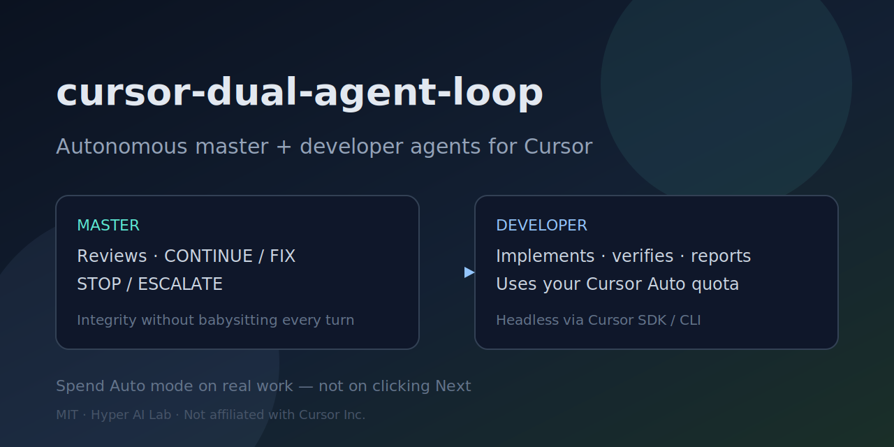
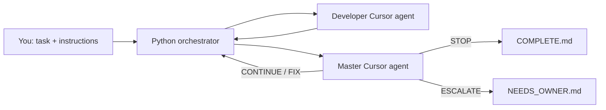

<p align="center">
  
</p>

# cursor-dual-agent-loop

**Turn Cursor Auto-mode quota into supervised autonomous coding** — a headless **master + developer** loop on top of the [Cursor](https://cursor.com) CLI / Python SDK.

[](LICENSE)
[](https://www.python.org/downloads/)
[](https://cursor.com/docs)
[](https://github.com/Hyper-AI-Lab/cursor-dual-agent-loop)

> Not affiliated with Cursor Inc. Built by [Hyper AI Lab](https://hyperailab.com/).

---

## The problem this solves

Many Cursor users have **plenty of Auto / agent quota**, but still burn time on **manual babysitting**:

| Reality today | Why it hurts |
|---------------|--------------|
| Every agent turn needs a human to check diffs, re-prompt, and click continue | Quota sits unused while you context-switch |
| Fully “fire and forget” single agents drift, skip verification, or stop early | Low integrity for anything beyond a toy edit |
| Heavy multi-agent frameworks exist, but setup is huge | Overkill for bounded tasks you *could* trust overnight |

**This repo is the middle path:** a small Python orchestrator runs two Cursor agents in a closed loop.

1. **Developer** — implements one coherent step, verifies when practical, reports structured output  
2. **Master** — reviews artifacts (not just prose) and returns `CONTINUE` / `FIX` / `STOP` / `ESCALATE`

You stay out of the loop for routine work. The master escalates only when judgment is required. Integrity comes from **review + write boundaries + structured decisions**, not from hoping one chat session behaves.

**Search terms:** Cursor agent loop · Cursor SDK automation · autonomous coding agent · multi-agent orchestrator · headless Cursor CLI · Auto mode automation · AI coding without babysitting

---

## Who it is for

- Cursor users with unused **Auto / agent quota** who want overnight or background progress  
- Teams that want **bounded autonomous tasks** (refactors, docs, tests, small features) with a supervisor agent  
- Anyone who wants **Cursor’s own agent engine** (SDK/CLI) without living in the desktop UI each turn  

**Not for:** unsupervised production deploys, secret-handling experiments, or unbounded “rewrite everything” jobs without human gates.

---

## How it works



| Component | What it is |
|-----------|------------|
| Orchestrator | Dumb plumbing: schedule turns, parse `DECISION`, write logs |
| Developer | Cursor agent (SDK or CLI) that edits and verifies |
| Master | Cursor agent that owns plan quality and stop/escalate |

`max_iterations` is an **orchestrator hard-stop only** — it is **not** shown to the master as a work budget (so the supervisor does not rush to “fit N turns”).

---

## Quick start (smoke test)

```bash
git clone https://github.com/Hyper-AI-Lab/cursor-dual-agent-loop.git
./cursor-dual-agent-loop/scripts/install-into-repo.sh /path/to/your-project

cd /path/to/your-project
export CURSOR_API_KEY="cursor_..."   # Cursor Dashboard → API Keys
pip install cursor-sdk pyyaml
curl https://cursor.com/install -fsS | bash
export PATH="$HOME/.local/bin:$PATH"

python auto/orchestrator/verify_prereqs.py

python auto/orchestrator/dual_agent_loop.py \
  --config auto/runs/hello-sandbox/config.yaml \
  --backend sdk
```

Full walkthrough: **[examples/hello-sandbox/README.md](examples/hello-sandbox/README.md)**  
Architecture: **[docs/ARCHITECTURE.md](docs/ARCHITECTURE.md)**  
Problem / design notes: **[docs/WHY.md](docs/WHY.md)**

---

## Minimal config

Two files + a few settings:

```yaml
task_id: my-task
workspace: .
model: auto
max_iterations: 40          # hard stop for the orchestrator only
backend: sdk
write_roots: ["."]          # narrow this for safer runs
safety_mode: "off"
master_instructions: path/to/instruction_for_master.md
task: path/to/task.md
```

| Field | Meaning |
|-------|---------|
| `workspace` | Directory agents work in |
| `model` | Cursor model id (e.g. `auto`) |
| `max_iterations` | Orchestrator kill-switch (hidden from master) |
| `master_instructions` | File 1 — master context / how to supervise |
| `task` | File 2 — goal the master uses to drive the developer |

Optional: `write_roots`, `safety_mode`, `run_dir`, `owner_reply`.  
Resume IDs live in `run_dir/run_state.yaml` (owner `config.yaml` is not rewritten).

---

## Loop sequence

1. **Bootstrap 1** — Master reads File 1 → `READY`  
2. **Bootstrap 2** — Master reads File 2 → first `DECISION` + `INSTRUCTION_FOR_DEVELOPER`  
3. **Loop** — Developer → Master review → next instruction until `STOP` / `ESCALATE` / hard-stop  

Master may set `DEVELOPER_MODE: agent|plan` per turn. Developer polls (`STATUS: Needs decision`) are answered by the master or escalated to you.

---

## Safety

- `write_roots` bounds Write/Delete (hooks under `.cursor/hooks/`)  
- `safety_mode: "off"` / `soft` — soft secret guidelines in prompts  
- `safety_mode: strict` — hard-block a short shell denylist (`git push`, `rm -rf /`, …)  
- Force-stop anytime with `Ctrl+C`

---

## Monitor / stop / resume

| Action | How |
|--------|-----|
| Monitor | `tail -f auto/runs/<task>/master.log` |
| Stop | `Ctrl+C` |
| Done | Read `COMPLETE.md` |
| Need input | Read `NEEDS_OWNER.md`, set `owner_reply`, `--resume` |

---

## Compare at a glance

| Approach | Human in the loop | Integrity | Setup |
|----------|-------------------|-----------|-------|
| Manual Cursor chat / Auto | Every turn | High (you check) | Zero |
| Single headless agent | Low | Variable | Low |
| Heavy multi-agent platforms | Configurable | High | High |
| **This repo** | On escalate / stop | Master review + boundaries | Small YAML + 2 files |

---

## Development (this repository)

```bash
pip install cursor-sdk pyyaml pytest
PYTHONPATH=. pytest tests/ -q
```

Maintainer sync with private forks: [SYNC.md](SYNC.md).

## Contributing & visibility

Issues and PRs welcome — see [CONTRIBUTING.md](CONTRIBUTING.md).  
If this saves you babysitting time, a ⭐ helps others find it under topics like `cursor-sdk`, `autonomous-coding`, and `multi-agent`.

## License

MIT — Copyright (c) 2026 Hyper-AI-Lab
